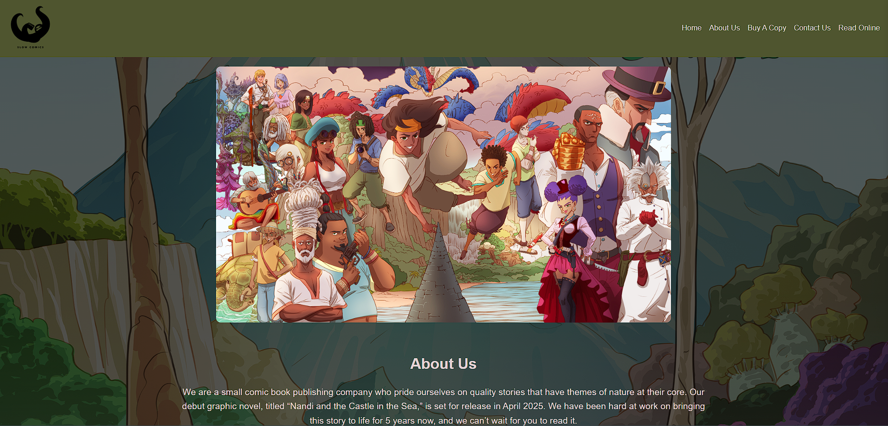
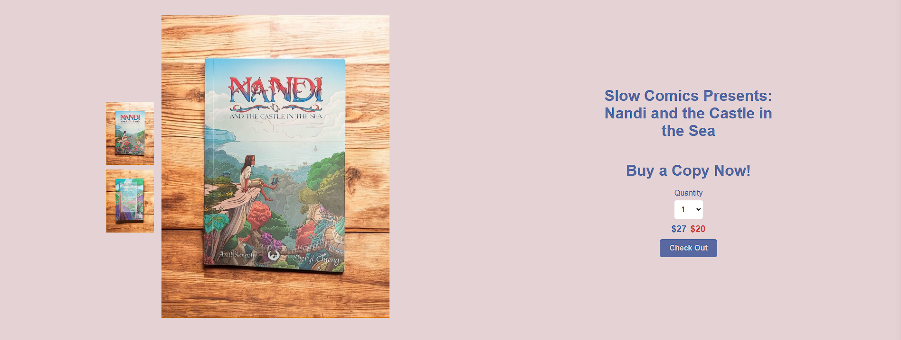
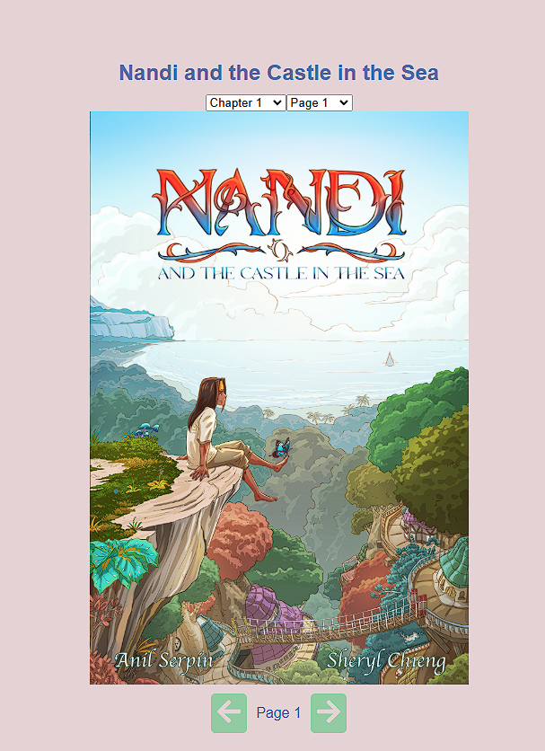

# SloCo-Official
# The Slow Comics Website

Welcome to the official repository for the Slow Comics e-commerce website! This site serves as a platform to showcase and sell graphic novels produced by Slow Comics, providing users with an easy way to purchase a copy and access a digital version.

## Features

- **Home Page**: Introduction to the graphic novel, an About Us section, and contact information.

- **About Us**: Background on the project and its creators.
- **Buy A Copy**: Single-product page with images, quantity selection, and checkout link.

- **Checkout**: Secure payment processing via PayPal, with shipping calculations and tracking implemented through the Shippo API.
- **Read Online**: Secure access to the digital PDF version for verified buyers.

## Technologies Used

- **Frontend**: React, React Router for navigation
- **Backend**: Node.js with Express using Shippo, Nodemailer, and AWS sdk for image storage through CloudFlare R2
- **Database**: PostgreSQL, Cloudflare R2
- **Payment Processing**: PayPal
- **Shipping Integration**: Shippo API
- **Authentication**: Email verification or code-based access for PDF reading

## Live Demo

Check out the live website here: (https://slowcomics.com)

## Future Enhancements

- More products for sale(stickers, pins, and future graphic novels)

## Contact

If you have any questions, feel free to reach out:
- Email: erenserpin@gmail.com, slow.comics.publishing@gmail.com

---

### License
This project is proprietary and all rights are reserved. Unauthorized use, distribution, or modification is prohibited without explicit permission from the owner.

